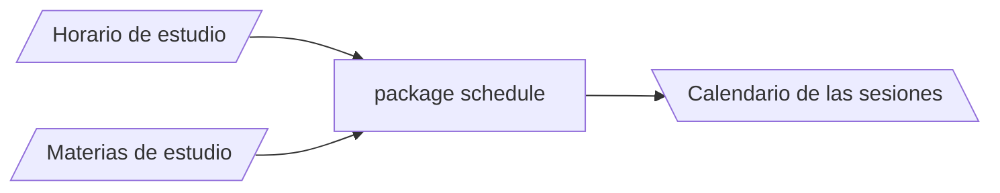

Este paquete proporciona una interfaz de programación para:
- Definir horarios de estudio semanales.
- Añadir materias de estudio (asignaturas) y hacer un seguimiento de su progreso.
- Obtener, a partir del horario de estudio y las materias, una planificación de las sesiones de estudio de las mismas (una fecha que incluye año, mes, día, hora y minuto).

## Interfaz de programación

Describo a continuación las clases y sus métodos públicos con los que la persona usuaria del paquete puede acceder a las funcionalidades que ofrece este.
> Notar que hay dos clases distintas haciendo referencia a intervalos de tiempo: `WeekInterval` e `Interval`. No guardan relación de herencia.

- `Planning`: Es la clase principal. Permite editar el horario de estudio y las materias a planificar y obtener un calendario con las sesiones de estudio.

	- `Planning()`: constructor. Inicializa un objecto `Planning` vacío.
	- `ArrayList<Session> getTimetable()`: devuelve una lista de objetos `Session` correspondientes a la planificación de las sesiones en el calendario.
	- `void updateDate(LocalDateTime date)`: actualiza la fecha almacenada por el objeto.
	
	- Métodos relacionados con el horario:
		- `boolean addWeekInterval(WeekInterval interval)`: añade un nuevo intervalo al horario de estudio semanal. Se requiere que no colisione ni linde con los existentes.
		- `boolean removeWeekInterval(WeekInterval interval)`: elimina un intervalo del horario estudio semanal.
		- `ArrayList<WeekInterval> getDayWeekInterval(int day)`: devuelve el horario semanal del día seleccionado.
		
	 - Métodos relacionados con las asignaturas:
		- `boolean addSubject(Subject subject)`: añade una nueva asignatura a la lista.
		- `boolean removeSubject(String nameOfSubject)`: elimina la asignatura indexada por su nombre de la lista.
		- `ArrayList<Subject> getSubjects()`: devuelve la lista de asignaturas.
		- `boolean setDifficultySubject(String nameSubject, int difficulty)`: cambia la dificultad de la asignatura especificada.
		- `boolean setSpaceSubject(String nameSubject, int space)`: cambia el espaciado entre sesiones de la asignatura especificada.
		- `boolean setPrioritySubject(String nameSubject, int priority)`: cambia la prioridad de la asignatura especificada.

- `WeekInterval`: inmutable. Almacena información sobre un intervalo de tiempo de la semana dentro del horario de estudio. Mide la semana como un "círculo" dado por el intervalo de enteros $[0, 60*24*7)$ que representan los minutos de la semana (ej.: $72$ representa la hora $01:12$ del lunes).

	- `WeekInterval(int start, int end)`: constructor. Inicializa un intervalo de la semana empezando en el minuto `start` y acabando en `end`.
	- `WeekInterval(WeekInterval interval)`: constructor. Clona el intervalo `interval`.
	- `boolean equals(WeekInterval interval)`: *override* el método `equals`.
	- `boolean collide(WeekInterval interval)`: comprueba si ambos intervalos colisionan o colindan.
	- `int getStart()`: devuelve minuto de inicio del intervalo.
	- `int getEnd()`: devuelve minuto en el que termina el intervalo.
	- `int getLength()`: devuelve la longitud del intervalo.
	- `int getDayStarOfInterval()`: devuelve el día en el que empieza el intervalo.
 
- `Subject`: inmutable. almacena la información referente a una asignatura (nombre, tipos de sesiones, dificultad, espaciado entre sesiones...). También tiene constancia del progreso del estudio de la misma almacenando el número de páginas y la página actual (la página por la que vas). Ajusta el ritmo de lectura según dos cosas: tu ritmo de lectura promedio y la dificultad de la asignatura.
 
	 - `Subject(String name, int pagesPerSessionGlobal, int difficulty, boolean exercises, int pages, int space, int priority)`: constructor.
	 - `Subject(Subject subject)`: constructor. Clona un objeto `Subject`.
	 - `String getName()`: devuelve el nombre de la asignatura.
	 - `int getDifficulty()`: devuelve la dificultad de la asignatura.
	 - `int getPriority()`: devuelve la prioridad de la asignatura (0 a 4).
	 - `int getPages()`: devuelve el número de páginas totales de la asignatura.
	 - `int getSpace()`: devuelve el número de días mínimos a transcurrir entre sesiones (espaciado).
	 - `int getCurrentPage()`: devuelve la página actual de la asignatura.
	 - `int pagesPerSession()`: devuelve el número de páginas por sesión.

- `Session`: inmutable. Esta clase encapsula la información referente a cada sesión almacenando la asignatura a la que corresponde, el intervalo de tiempo en el calendario en la que se desarrolla y el tipo de sesión.

	- `String getTypeOfSession()`: devuelve el tipo de la sesión.
	- `Subject getSubject()`: devuelve la asignatura correspondiente a la sesión.
	- `Interval getInterval()`: devuelve el intervalo del calendario en el que se desarrolla la asignatura.

- `Interval`: inmutable. Encapsula la información sobre un evento en el calendario. Almacena una variable correspondiente al inicio y otra a instante en el que acaba dicho evento. Usa la clase `LocalDateTime` de `java.time`.

	- `static int formatLocalDateTime(LocalDateTime date)`: transforma una fecha del calendario en el minuto de la semana correspondiente.
	- `LocalDateTime getStart()`: devuelve el momento en el que empieza el intervalo.
	- `LocalDateTime getEnd()`: devuelve el momento en el que termina el intervalo.
	- `int getLength()`: devuelve la longitud del intervalo en minutos.

## Algoritmo de planificación

El package divide la tarea de planificar las sesiones en dos partes independientes que reciben los nombres de planificación interna y planificación eterna.

- Planificación interna: se trata de elegir el orden que siguen las sesiones de distinto tipo dentro de una misma asignatura. 
- Planificación externa: entre todas las sesiones de distintas asignaturas, se trata de ordenarlas y asignarles una fecha en el calendario.

Esta separación facilita el proceso de planificar todas las sesiones a nivel conceptual. Internamente, en `Subject` existe un método `getSessions()`, oculto para la interfaz de programación, que proporciona una lista de las sesiones de una misma asignatura que se distribuyen en el calendario al llamar a `getTimetable()` desde un objeto `Planning`. Paso a concretar en qué consisten las dos partes de la planificación.

### Planificación interna

Cada objeto `Subject` almacena información referente a la proporción de los distintos tipos de sesiones que tendrán lugar. Hay un tipo de sesión, indexada por `standard`, que consisten en leer la cantidad de páginas que se haya planificado. Estas son las que, de alguna manera, marcan el progreso de la asignatura.

Para planificar las sesiones de una misma asignatura, se empieza por decidir el número de sesiones "estándar" (de lectura) que tendrán lugar. Para ello, simplemente se divide el número de páginas por una variable que almacena el ritmo de lectura (páginas por sesión). Conociendo las proporciones de los demás tipos de sesiones, se crean las correspondientes sesiones y se intercalan en un vector de sesiones estándar de manera que estén igualmente distribuidas.

### Planificación externa

La clase `Planning` almacena, esencialmente, dos informaciones distintas:
- Horario de estudio y huecos libres en el calendario.
- Asignaturas a planificar.

Este planificador actúa como sigue. Primero, se agrupan las asignaturas por prioridad en distintas listas. Las asignaturas más prioritarias serán planificadas primero. Iterando sobre la lista de asignaturas más prioritarias, se selecciona una asignatura y se obtiene la siguiente sesión a planificar. Se busca el primer hue